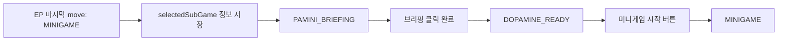

# DOPAMINE_READY 진입 전 파미니 브리핑 설계

## 목표

매일 에피소드가 끝나고 미니게임 준비 화면으로 들어가기 전에 파미니가 짧게 브리핑한다.

- 시나리오 데이터에 매번 브리핑 대사를 추가하지 않는다.
- 기존 `STORY` 씬의 배경, 캐릭터, 대화창과 거의 같은 모습으로 보이게 한다.
- 파미니가 오늘 선택을 간접적으로 평가하고, 오늘의 도파민 상태를 직접 수치 없이 말한다.
- 브리핑이 끝나면 기존 `DOPAMINE_READY` 화면으로 넘어가고, 거기서 미니게임 시작 버튼을 누른다.

## 현재 흐름

현재 `move` 노드가 `next: "MINIGAME"`이면 바로 `DOPAMINE_READY`로 이동한다.

관련 위치:

- `game.js`의 `processStoryCommandNodes()`
- `game.js`의 `goToNextTarget()`
- `game.js`의 `changeScene(SCENES.DOPAMINE_READY)`

주의할 점:

- 도파민은 매일 밤 리셋하지 않는다.
- 기존 코드에 `DOPAMINE_READY` 진입 시 `resetDopamineForReady()`가 실행되는 흐름이 남아 있다면 제거하거나 호출하지 않도록 바꾼다.
- 브리핑과 미니게임 준비 화면은 오늘의 실제 선택 결과로 누적된 현재 `dopamine`과 `affection`을 그대로 사용한다.

## 권장 구조

새 씬을 하나 추가한다.

```js
const SCENES = {
  ...
  PAMINI_BRIEFING: "paminiBriefing",
  DOPAMINE_READY: "dopamineReady",
  ...
};
```

`MINIGAME` 이동 요청 흐름은 다음처럼 바꾼다.



즉, `processStoryCommandNodes()`와 `goToNextTarget()`에서 기존에 `changeScene(SCENES.DOPAMINE_READY)` 하던 부분을 `changeScene(SCENES.PAMINI_BRIEFING)`으로 바꾼다.

## 브리핑 상태

`Game.state`나 `Game` 인스턴스에 다음 상태를 둔다.

```js
this.paminiBriefing = {
  lines: [],
  index: 0,
  snapshot: null
};
```

`snapshot`에는 현재 값을 그대로 저장한다.

```js
{
  dopamine: this.state.dopamine,
  affection: this.state.affection,
  episodeId: this.state.episodeId
}
```

## 브리핑 생성 규칙

정확한 수치나 선택지 내용을 말하지 않는다.

### 선택 브리핑

호감도 기준으로 간접 평가한다.

- `affection >= 60`: "오늘은 꽤 좋은 흐름이었어. 상대의 마음을 너무 밀어붙이지 않고 잘 따라간 느낌이야."
- `affection >= 35`: "나쁘지 않았어. 다만 몇 번은 마음보다 타이밍을 조금 더 봤으면 좋았을지도 몰라."
- 그 외: "오늘은 마음이 앞서거나 엇갈린 순간이 있었어. 내일은 한 박자만 더 천천히 가보자."

호감도 수치를 직접 보여주지 않는다.

### 도파민 브리핑

도파민 기준으로 간접 평가한다.

- `dopamine < 40`: "도파민은 꽤 가라앉아 있었어. 내일은 말이 늦게 나오거나 기회를 놓치기 쉬울 수 있어."
- `40 <= dopamine <= 80`: "도파민 흐름은 비교적 안정적이야. 설렘과 침착함이 같이 남아 있는 상태라고 보면 돼."
- `dopamine > 80`: "도파민이 많이 달아올랐어. 이 상태가 이어지면 내일은 감정이 먼저 튀어나올 수 있어."

도파민 수치를 직접 말하지 않는다.

### 미니게임 연결 대사

마지막 줄은 항상 밤의 미니게임으로 자연스럽게 이어지게 한다.

예시:

```js
"그럼 이제 꿈속에서 내일의 도파민을 다시 맞춰보자. 너무 낮지도, 너무 과열되지도 않게."
```

## 화면 연출

`PAMINI_BRIEFING`은 기존 `STORY`처럼 보이게 한다.

권장:

- 배경: `꿈속` 특수 배경 또는 현재 `DOPAMINE_READY`의 침실 배경 위에 어둡게 오버레이
- 캐릭터: 파미니 좌측 배치
- 대화창: 기존 `TextBox` 사용
- 이름 표시: `파미니`
- 진행: 클릭 또는 Enter/Space로 다음 줄
- 마지막 줄 이후: `changeScene(SCENES.DOPAMINE_READY)`

기존 `drawStory()`를 억지로 재사용하기보다는, 아래처럼 작은 전용 draw/handler를 두는 편이 안전하다.

```js
drawPaminiBriefing()
handlePaminiBriefingClick()
getCurrentPaminiBriefingLine()
advancePaminiBriefing()
buildPaminiBriefingLines(snapshot)
```

## DOPAMINE_READY 도파민 유지

`DOPAMINE_READY`에 들어가도 도파민을 새 값으로 리셋하지 않는다.

브리핑 생성과 준비 화면은 같은 현재 도파민 값을 공유한다.

권장 흐름:

```js
startPaminiBriefingBeforeReady() {
  this.paminiBriefing = {
    lines: this.buildPaminiBriefingLines({
      dopamine: this.state.dopamine,
      affection: this.state.affection,
      episodeId: this.state.episodeId
    }),
    index: 0
  };
  this.changeScene(SCENES.PAMINI_BRIEFING);
}
```

브리핑이 끝날 때:

```js
finishPaminiBriefing() {
  this.paminiBriefing = null;
  this.changeScene(SCENES.DOPAMINE_READY);
}
```

기존 코드의 `changeScene(scene)`에 아래와 같은 분기가 있다면 삭제하거나 비활성화한다.

```js
if (scene === SCENES.DOPAMINE_READY) {
  this.resetDopamineForReady();
}
```

## 저장/불러오기

현재 save는 `STORY`와 `DOPAMINE_READY`에서 가능하다.

권장:

- `PAMINI_BRIEFING`에서는 저장 버튼을 숨기거나 비활성화한다.
- 저장 지원이 필요하면 `paminiBriefing.index`, `selectedSubGame`, `selectedSubGameReturn`, `selectedSubGameOptions`까지 snapshot에 포함해야 한다.
- 첫 구현에서는 브리핑 중 저장 불가가 가장 단순하다.

## 구현 체크리스트

1. `config.js`에 `SCENES.PAMINI_BRIEFING` 추가
2. `Game`에 `paminiBriefing` 상태 추가
3. `MINIGAME` 이동 지점 두 곳에서 `DOPAMINE_READY` 대신 브리핑 시작 함수 호출
4. `buildPaminiBriefingLines(snapshot)` 구현
5. `draw()`에 `PAMINI_BRIEFING` 분기 추가
6. `mousePressed()`와 `keyPressed()`에 브리핑 진행 처리 추가
7. 브리핑 완료 시 기존 `DOPAMINE_READY`로 이동
8. 기존 `DOPAMINE_READY`의 `resetDopamineForReady()` 호출 제거 또는 비활성화

## 검증 기준

- EP1 종료 후 바로 준비 화면이 아니라 파미니 브리핑이 먼저 나온다.
- 브리핑 화면은 기존 스토리 대화처럼 보인다.
- 파미니가 좌측에 표시된다.
- 브리핑은 수치를 직접 말하지 않는다.
- 클릭 또는 Enter/Space로 줄이 넘어간다.
- 마지막 줄 이후 기존 `DOPAMINE_READY` 화면으로 간다.
- `DOPAMINE_READY`에서 도파민이 리셋되지 않는다.
- 미니게임 시작 버튼과 건너뛰기 버튼은 기존처럼 작동한다.
- 시나리오 데이터에 브리핑용 노드를 추가하지 않아도 매 EP 미니게임 진입 전에 동작한다.
